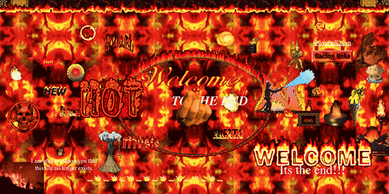
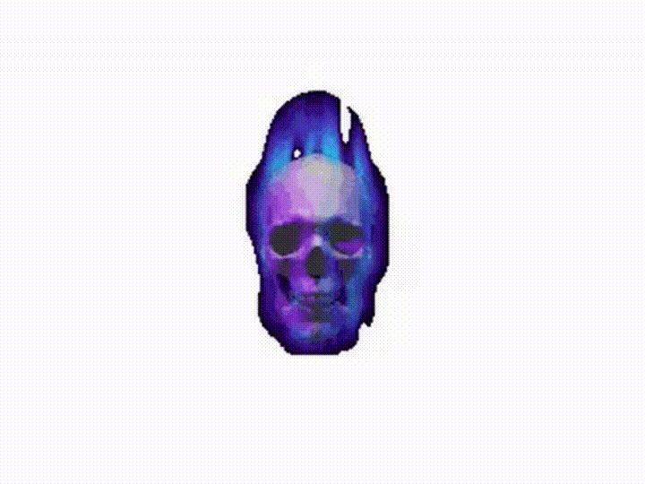
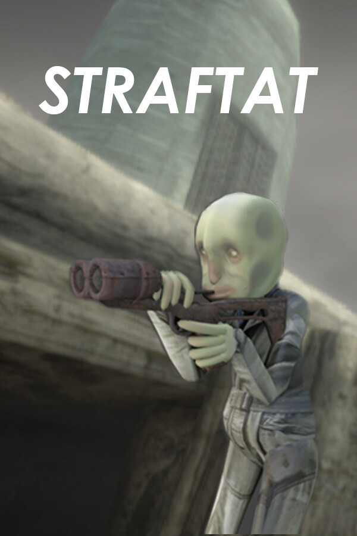
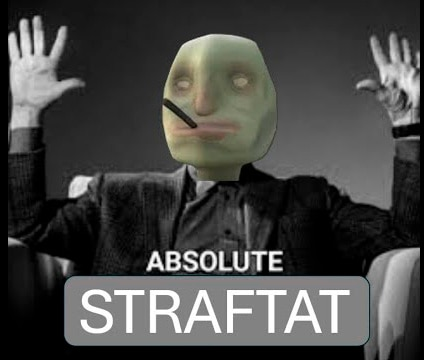
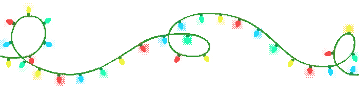
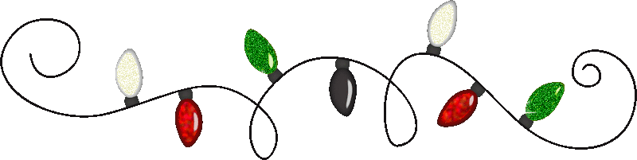
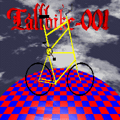
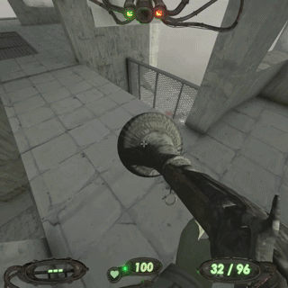
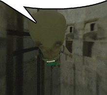

<div align="center">

<table>
  <tr>
    <td width="260" align="center">
      <a href="https://github.com/darkone0112/absolute-straftat/releases/latest/download/absolute-straftat-installer.exe">
        
      </a><br>
      <a href="https://github.com/darkone0112/absolute-straftat/releases/latest/download/absolute-straftat-installer.exe">
        
      </a><br>
      <b>WINDOWS .EXE</b>
    </td>
    <td width="40"></td>
    <td width="260" align="center">
      <a href="https://github.com/darkone0112/absolute-straftat/releases/latest/download/absolute-straftat-installer">
        
      </a><br>
      <a href="https://github.com/darkone0112/absolute-straftat/releases/latest/download/absolute-straftat-installer">
        
      </a><br>
      <b>LINUX</b>
    </td>
  </tr>
</table>

<br>



# ABSOLUTE STRAFTAT

<table>
  <tr>
    <td></td>
    <td>
      <br>
      
    </td>
    <td></td>
  </tr>
</table>




<br><br>

<table>
  <tr>
    <td></td>
    <td>
      <b>WELCOME TO THE ABSOLUTE STRAFTAT INSTALLATION ZONE</b><br>
      Download the latest release. Run the installer. The folder will be asked several questions.
    </td>
    <td></td>
  </tr>
</table>

<br>

<a href="https://github.com/darkone0112/absolute-straftat/releases/latest">
  
</a>

<br><br>


</div>

<table>
  <tr>
    <td width="90"></td>
    <td width="520">

## WHAT IS THIS

Absolute STRAFTAT is the installer that does the folder chores while you stand nearby looking technically involved.

It finds STRAFTAT, checks whether the required mod pile is already there, downloads only what is missing, and places the files into `BepInEx/plugins` with the confidence of a printer that has never jammed.

    </td>
    <td width="90"></td>
  </tr>
</table>

<div align="center">


</div>

<table>
  <tr>
    <td width="70"></td>
    <td width="560">

## HOW TO USE IT WITHOUT BECOMING A SYSTEM ADMINISTRATOR

<table>
  <tr><th width="40">#</th><th width="190">Instruction</th><th width="300">Actual behavior</th></tr>
  <tr><td>1</td><td>Pick your system</td><td>Use Windows or Linux at the top.</td></tr>
  <tr><td>2</td><td>Download</td><td>Click the download GIF. It is legally a button.</td></tr>
  <tr><td>3</td><td>Run it</td><td>Double click on Windows. Run the file on Linux.</td></tr>
  <tr><td>4</td><td>Answer folder question</td><td>If asked, paste the STRAFTAT folder.</td></tr>
  <tr><td>5</td><td>Wait</td><td>Missing files get installed. Existing files get respected.</td></tr>
  <tr><td>6</td><td>Close popup</td><td>Press the animated button after it finishes performing.</td></tr>
  <tr><td>7</td><td>Play</td><td>Launch STRAFTAT and observe the paperwork.</td></tr>
</table>

    </td>
    <td width="70"></td>
  </tr>
</table>

<div align="center">





</div>

<table>
  <tr>
    <td width="80"></td>
    <td width="560">

## WHAT THIS INSTALLS

<table>
  <tr><th width="230">Object</th><th width="300">Official folder opinion</th></tr>
  <tr><td>BepInEx</td><td>Required plumbing with a badge.</td></tr>
  <tr><td>Mod Menu</td><td>The menu that admits things are happening.</td></tr>
  <tr><td>moreStrafts</td><td>Additional STRAFTAT behavior.</td></tr>
  <tr><td>Straftat GunGame</td><td>A procedure for weapon bureaucracy.</td></tr>
  <tr><td>MoreStrafts UISpawnAddon</td><td>Button-adjacent decisions.</td></tr>
  <tr><td>Fancy</td><td>Visual manners.</td></tr>
  <tr><td>Straftat Cosmetics Bundle IC</td><td>Wardrobe evidence.</td></tr>
</table>

    </td>
    <td width="80"></td>
  </tr>
</table>

<div align="center">


</div>

## RELEASES

 Releases are named like:

```text
Absolute STRAFTAT v0.1.<github-run-number>
```

The updater helper is called `bonjour`, but the release is Absolute STRAFTAT because bonjour is only the clerk at the front desk.

<div align="center">


</div>

## GUESTBOOK

<table>
  <tr>
    <td></td>
    <td>
      <a href="https://github.com/darkone0112/absolute-straftat/issues/new?template=guestbook.yml"><b>SIGN THE GUESTBOOK</b></a><br>
      The issue form writes to this README automatically and then quietly closes the issue.
    </td>
    <td></td>
  </tr>
</table>

| Date | Name | Message |
|---|---|---|
<!-- GUESTBOOK:START -->
| 2026-05-24 | xx_strafffer2007_xx | I installed the installer and the installer installed me |
| 1999-12-31 | site admin | first. this table has legal weight in zero jurisdictions. |
<!-- GUESTBOOK:END -->

<div align="center">


<br><br>


<br>

<sub>Best viewed in a window that was opened by accident.</sub>

</div>
