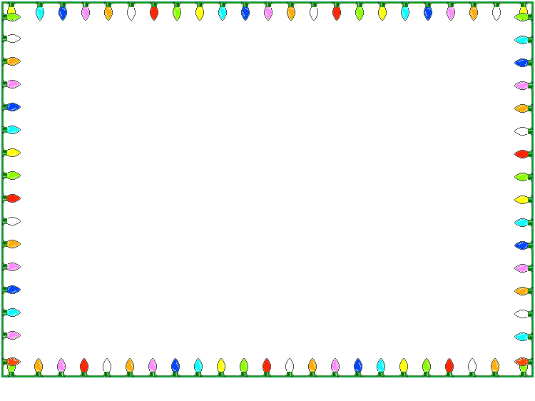
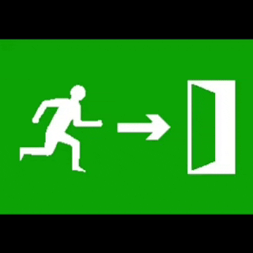

<div align="center">



# ABSOLUTE STRAFTAT


<br>

 <b>installer page last inspected by a committee with no chairperson</b> 

<br><br>

<table>
  <tr>
    <td></td>
    <td>
      <b>WELCOME TO THE ABSOLUTE STRAFTAT INSTALLATION ZONE</b><br>
      This page is optimized for monitors that have made peace with uncertainty.<br>
      Download the latest release. Run the installer. Allow the folder to reach a conclusion.
    </td>
    <td></td>
  </tr>
</table>

<br>

<a href="https://github.com/darkone0112/absolute-straftat/releases/latest">
  
</a>

<br><br>


</div>

## WHAT THIS INSTALLS

| Object | Official Folder Opinion |
|---|---|
| BepInEx | Required plumbing with a badge |
| Mod Menu | The menu that admits things are happening |
| moreStrafts | Additional STRAFTAT behavior, documented by vibes |
| Straftat GunGame | A procedure for weapon bureaucracy |
| MoreStrafts UISpawnAddon | Button-adjacent decisions |
| Fancy | Visual manners |
| Straftat Cosmetics Bundle IC | Wardrobe evidence |

## RELEASES

Releases are named like:

```text
Absolute STRAFTAT v0.1.<github-run-number>
```

The updater helper is called `bonjour`, but the release is Absolute STRAFTAT because bonjour is only the clerk at the front desk.

## GUESTBOOK

Want your name in this extremely public table?

<a href="https://github.com/darkone0112/absolute-straftat/issues/new?template=guestbook.yml"><b>SIGN THE GUESTBOOK</b></a>

The issue form writes to this README automatically and then quietly closes the issue.

| Date | Name | Message |
|---|---|---|
<!-- GUESTBOOK:START -->
| 1999-12-31 | site admin | first. this table has legal weight in zero jurisdictions. |
<!-- GUESTBOOK:END -->

<div align="center">


<sub>Best viewed in a window you forgot was open.</sub>

</div>
